# My Local Notion — User Guide

A local, browser-only notebook app for documents and kanban boards. All your data stays in the browser — no accounts, no cloud, no sign-up.

---

## Table of Contents

- [Getting Started](#getting-started)
- [Creating Pages](#creating-pages)
- [Writing Documents](#writing-documents)
- [Using Icons](#using-icons)
- [Kanban Boards](#kanban-boards)
- [Editing Cards](#editing-cards)
- [Subtasks](#subtasks)
- [Nested Pages & Breadcrumbs](#nested-pages--breadcrumbs)
- [Sidebar Navigation](#sidebar-navigation)
- [Search](#search)
- [Dark Mode](#dark-mode)
- [Export & Import](#export--import)
- [Keyboard Shortcuts](#keyboard-shortcuts)
- [Data & Privacy](#data--privacy)

---

## Getting Started

When you first open the app, you'll see an empty workspace with a sidebar on the left. The sidebar shows "No pages yet" and a **+** button to create your first page.

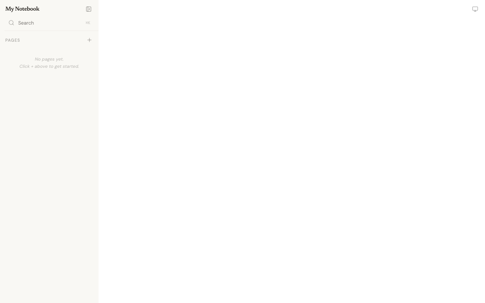

---

## Creating Pages

Click the **+** button next to "Pages" in the sidebar. A dropdown menu appears with two options:

- **Document** — A rich-text page for notes, writing, and general content
- **Board** — A kanban board with columns and cards for task management

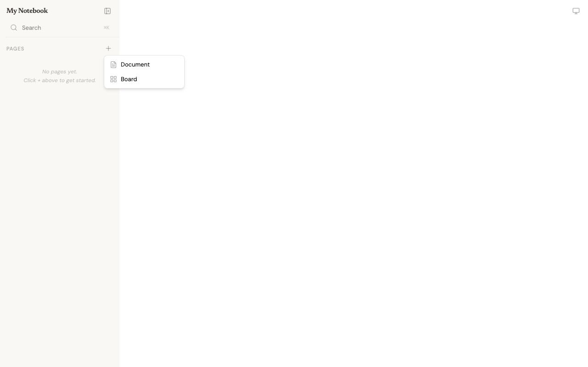

Select one to create your page. You'll be taken to it immediately.

---

## Writing Documents

The document editor is a full-featured block editor. Click into the page title at the top to name your page, then click the editor area below to start writing.

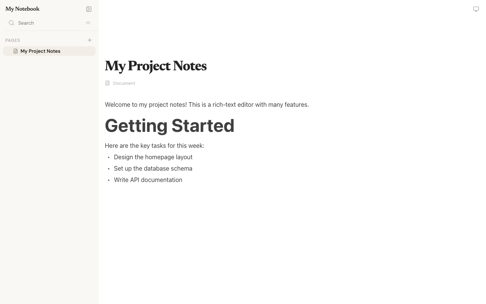

### Slash Commands

Type **`/`** on an empty line to open the block menu. Choose from a wide range of block types:

| Block Type      | Description                          |
| --------------- | ------------------------------------ |
| Heading 1–6     | Section headings of various levels   |
| Bullet List     | Unordered list items                 |
| Numbered List   | Ordered list items                   |
| Check List      | Checklist with toggleable checkboxes |
| Quote           | Quoted text or excerpts              |
| Code Block      | Code with syntax highlighting        |
| Toggle List     | Collapsible content sections         |
| Table           | Editable table with rows and columns |
| Divider         | Horizontal separator line            |
| Image / Video   | Embedded media with captions         |

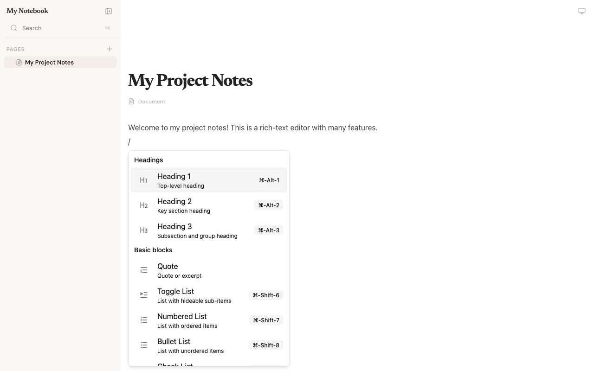

### Text Formatting

Select text to reveal a formatting toolbar with options for **bold**, *italic*, underline, strikethrough, code, and links. You can also use standard keyboard shortcuts:

- **Bold** — `⌘+B`
- **Italic** — `⌘+I`
- **Underline** — `⌘+U`

---

## Using Icons

Every page can have an emoji icon. Hover over the area above the title and click **Add icon** to open the icon picker. Click any emoji to set it as the page icon.

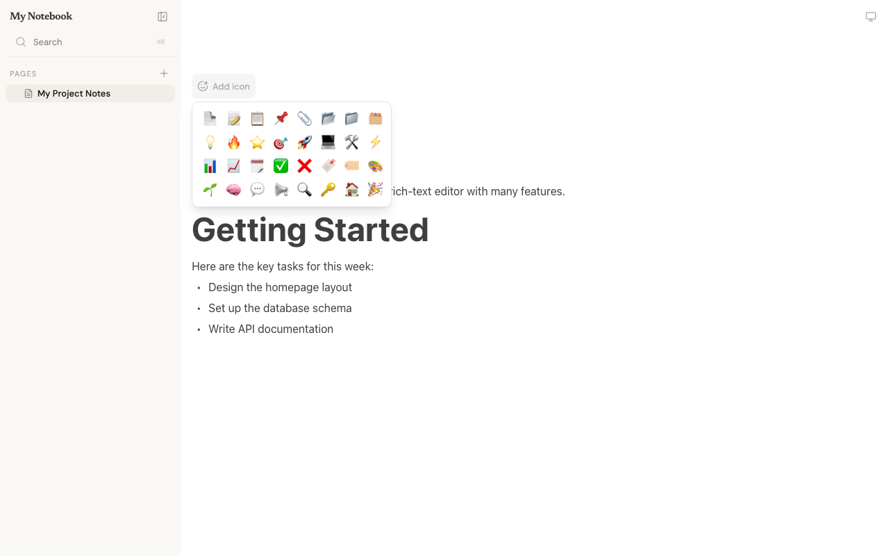

The icon appears next to the page title and in the sidebar for easy identification.

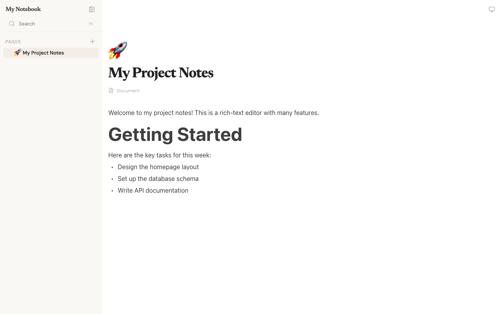

To change an existing icon, click it and select a new one from the picker.

---

## Kanban Boards

Kanban boards help you organize tasks in columns. When you create a **Board** page, it comes with three default columns: **To Do**, **In Progress**, and **Done**.

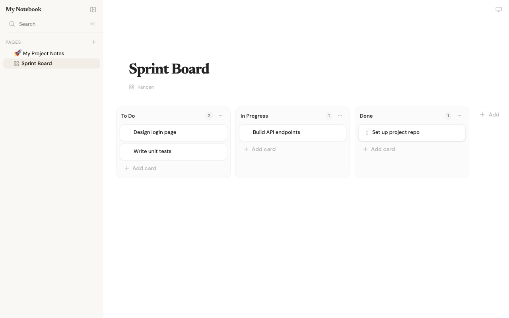

### Adding Cards

Click **+ Add card** at the bottom of any column. Type a title and press **Enter** or click **Add** to create the card.

### Moving Cards

Drag and drop cards between columns or reorder them within a column using the grip handle on the left side of each card.

### Adding Columns

Click **+ Add column** on the right side of the board to add new columns. You can rename or delete columns via the **⋯** menu in each column header.

---

## Editing Cards

Click on any card to open the detail dialog. Here you can:

- Edit the card **title**
- Add or update a **description**
- **Delete** the card using the red Delete button
- Click **Save** or press **Enter** to save changes

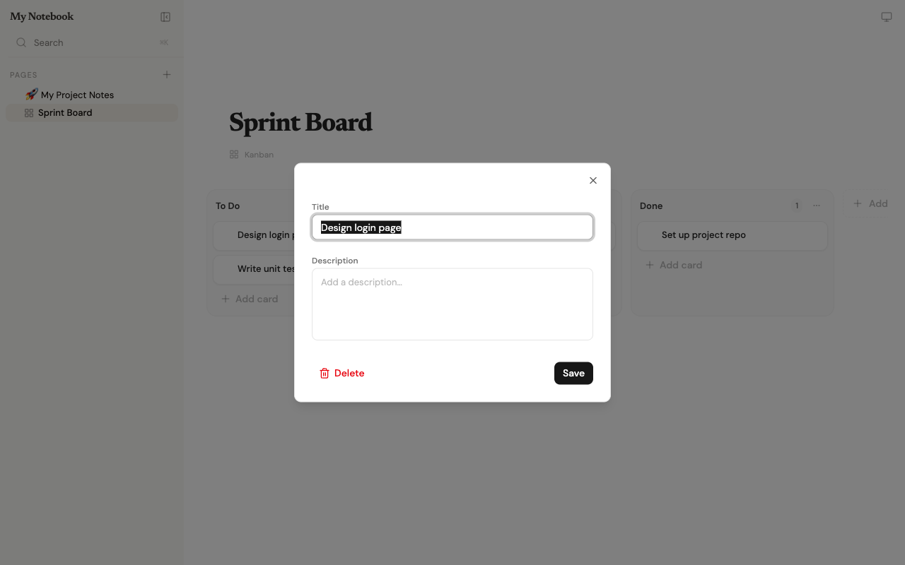

---

## Subtasks

Subtasks help you break down complex cards into smaller, manageable pieces. Any card on a kanban board can have subtasks.

### Adding Subtasks

Click on any card to open its detail dialog. In the **Subtasks** section, click **+ Add** to create a new subtask.

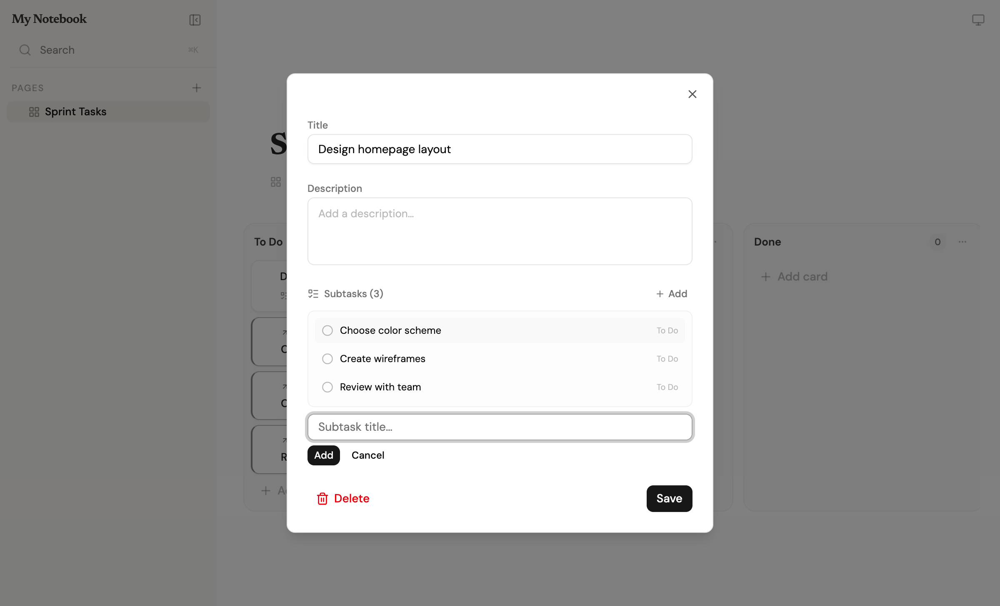

Type the subtask title and press **Enter** or click **Add** to create it. Subtasks are added to the same column as the parent card initially.

### Viewing Subtasks

The parent card's detail dialog shows all its subtasks in a list. Each subtask displays:

- A **status circle** — empty for incomplete, filled for complete
- The **subtask title**
- The **current column** the subtask is in (e.g., "To Do", "In Progress", "Done")

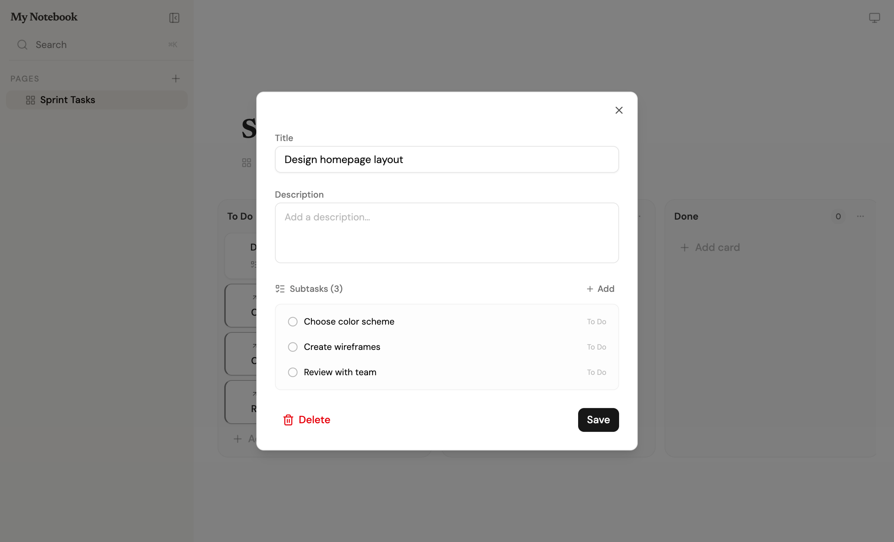

Click any subtask in the list to open its detail dialog.

### Subtasks on the Board

Subtasks appear as separate cards on the kanban board, just like regular cards. They can be:

- **Dragged** between columns independently of their parent
- **Identified** by a small label showing the parent card's title

The parent card displays a **progress badge** (e.g., "0/3 done") showing how many subtasks are complete.

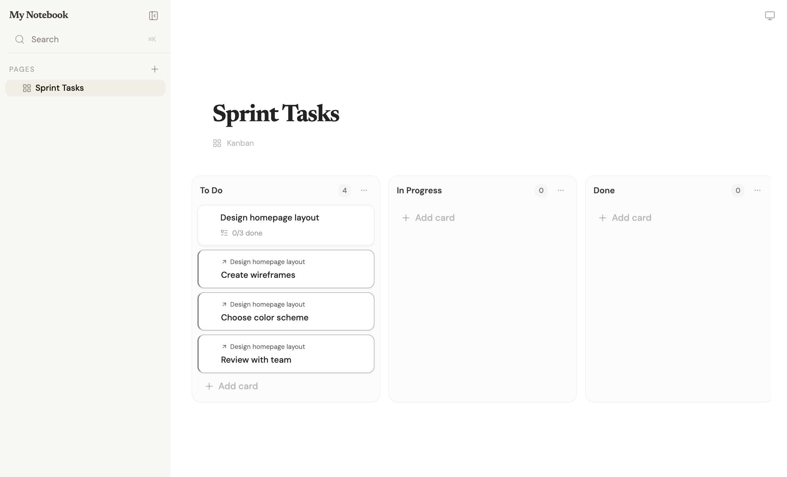

### Subtask Details

Click a subtask card to open its detail dialog. Subtask dialogs show:

- A **Parent** link at the top — click to navigate to the parent card
- The usual **Title** and **Description** fields
- A **Promote** button to convert the subtask into a standalone card

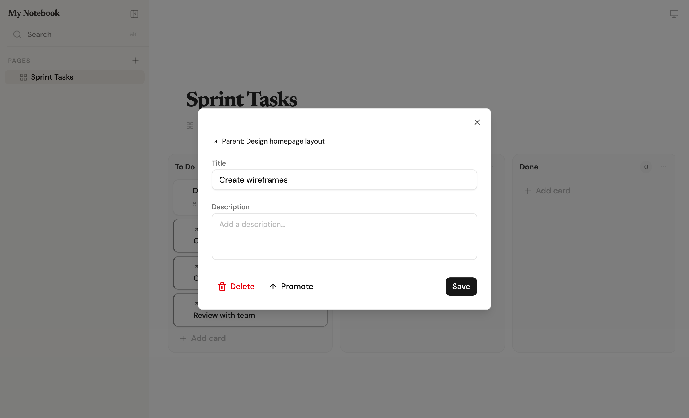

### Promoting Subtasks

If a subtask grows in scope and should become its own card, click the **Promote** button in the subtask's detail dialog. This removes the parent relationship, turning it into a regular standalone card.

### Key Points

- Subtasks can **move independently** between columns
- A subtask is marked **complete** when moved to the last column (typically "Done")
- Subtasks are **one level only** — subtasks cannot have their own subtasks
- **Deleting a parent card** also deletes all its subtasks

---

## Nested Pages & Breadcrumbs

You can create sub-pages under any existing page. Hover over a page in the sidebar and click the **+** button, then choose **Document** or **Board**.

Sub-pages appear nested under their parent in the sidebar tree. A breadcrumb trail appears at the top of each sub-page showing the full path from root to current page. Click any breadcrumb to navigate to that ancestor page.

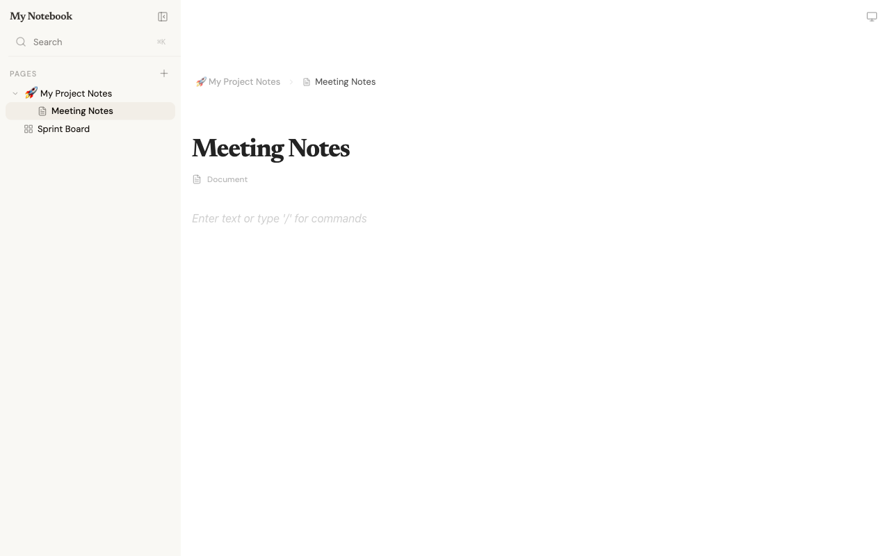

Click the **chevron arrow** (›) next to a parent page in the sidebar to expand or collapse its children.

---

## Sidebar Navigation

The sidebar is your central hub for navigating pages:

- **Click** a page name to navigate to it
- **Hover** over a page to reveal action buttons:
  - **+** — Add a sub-page (Document or Board)
  - **⋯** — Open the context menu with Rename and Delete options

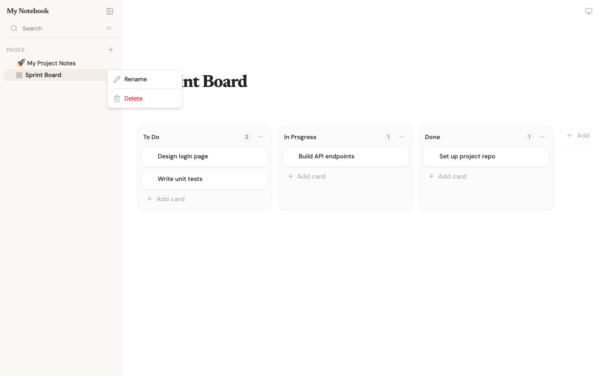

### Collapsing the Sidebar

Click the **collapse icon** (⊟) in the top-right corner of the sidebar to hide it and gain more editor space. Click the **expand icon** to bring it back. You can also press **`⌘+\`** to toggle the sidebar.

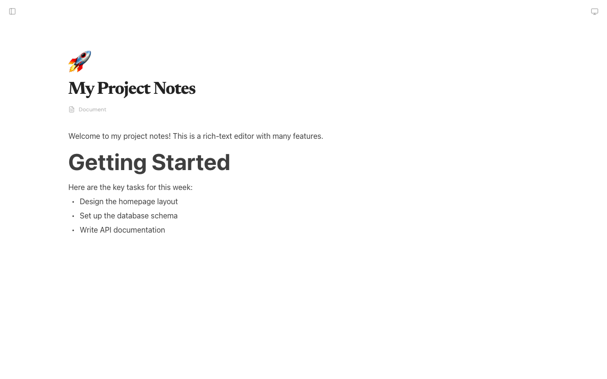

---

## Search

Press **`⌘+K`** anywhere in the app to open the search dialog. All your pages appear in a searchable list. Type to filter by page name, then press **Enter** or click a result to navigate directly to that page.

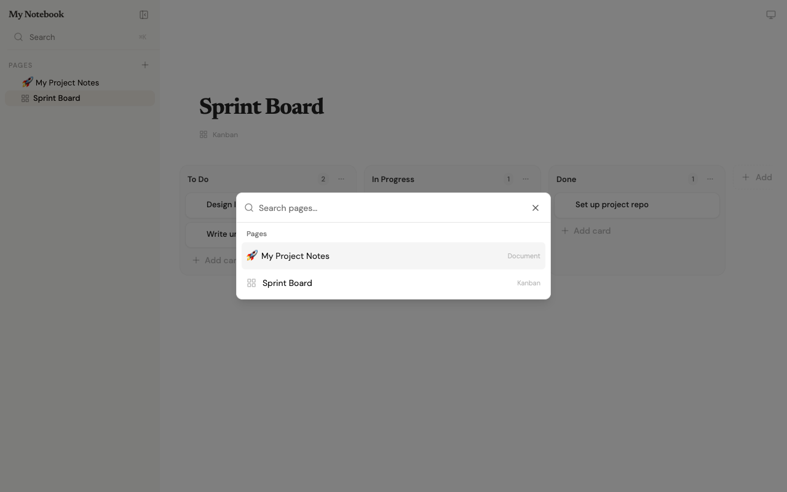

The search shows each page's icon and type (Document or Kanban) for easy identification.

---

## Dark Mode

The app supports light and dark themes. Click the **theme toggle** button in the top-right corner of the main content area to switch between modes. The theme cycles through:

1. **Light** (☀️) — Light background
2. **Dark** (🌙) — Dark background
3. **System** (🖥️) — Follows your operating system preference

### Dark Mode — Kanban Board

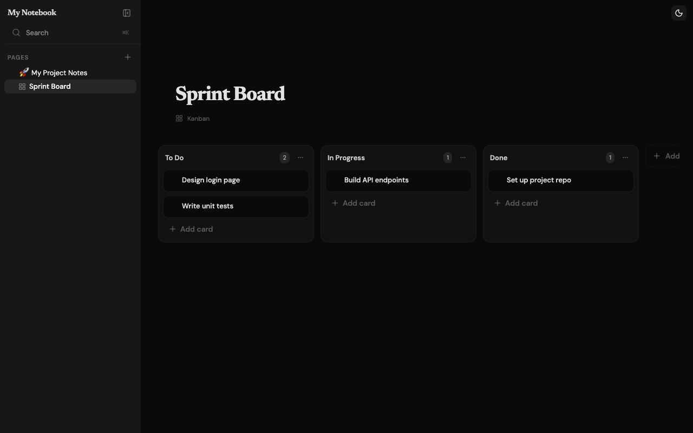

### Dark Mode — Document Editor

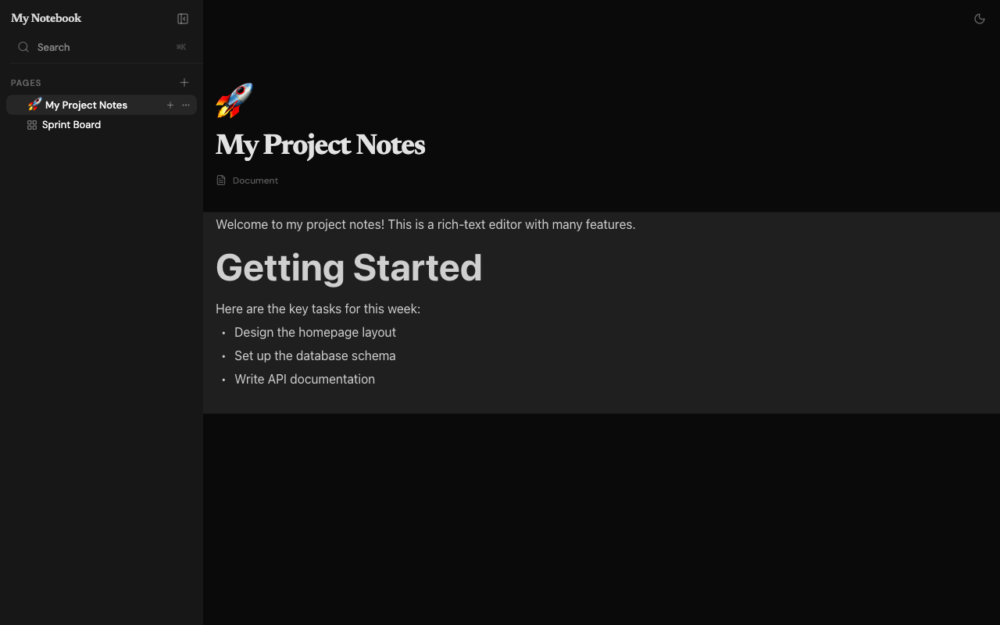

Your theme preference is saved and persists across browser sessions.

---

## Export & Import

Sync your workspace across devices using a single JSON file. No accounts, no cloud services — just export on one device and import on another.

### Opening the Export / Import Dialog

1. Click **Settings** at the bottom of the sidebar
2. Select **Import / Export** from the menu

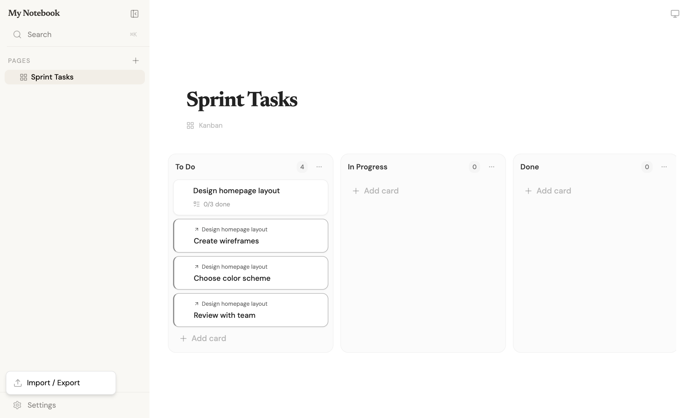

### Exporting Your Workspace

In the Export / Import dialog, click **Export Workspace** to download a `my-notebook-YYYY-MM-DD.json` file.

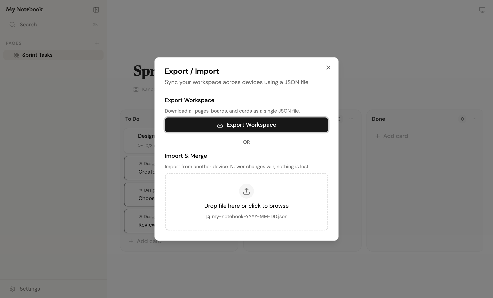

Alternatively, press **`⌘+Shift+E`** anywhere in the app for a quick export (downloads immediately without opening the dialog).

The export file contains all your pages, kanban boards, cards, and subtasks.

### Importing & Merging

1. Open the Import / Export dialog from **Settings** in the sidebar
2. Drag and drop your exported JSON file onto the drop zone, or click to browse
3. The app **merges** the imported data with your existing data

### How Merge Works

- **Newer changes win**: If the same page or card exists in both places, the one with the more recent `updatedAt` timestamp is kept
- **Nothing is lost**: Items that exist only in the import file are added; items that exist only locally are preserved
- **Edit beats delete**: If you edited something on one device and deleted it on another, the edit is preserved (safer default)
- **Deletions sync**: Items you deleted are tracked, so they won't reappear when you import from an older backup

After import, a summary shows how many pages/cards were added, updated, or deleted.

### Sync Workflow

For ongoing sync between devices (e.g., laptop and desktop):

1. **Export** from Device A and save the file to a cloud-synced folder (iCloud Drive, Dropbox, Google Drive, OneDrive)
2. **Import** the file on Device B
3. **Export** from Device B back to the same cloud folder
4. **Import** on Device A when ready

This bidirectional workflow keeps both devices in sync without needing a server.

---

## Keyboard Shortcuts

| Shortcut           | Action                        |
| ------------------ | ----------------------------- |
| `⌘+K`             | Open page search              |
| `⌘+N`             | Create a new page             |
| `⌘+\`             | Toggle sidebar                |
| `⌘+Shift+E`       | Quick export (download JSON)  |
| `⌘+Shift+L`       | Cycle theme (light/dark/sys)  |
| `⌘+B`             | Bold text                     |
| `⌘+I`             | Italic text                   |
| `⌘+U`             | Underline text                |
| `⌘+Alt+1` to `6`  | Heading levels 1–6            |
| `⌘+Alt+0`         | Paragraph (normal text)       |
| `⌘+Shift+7`       | Numbered list                 |
| `⌘+Shift+8`       | Bullet list                   |
| `⌘+Shift+9`       | Check list                    |
| `/`                | Open slash command menu        |

---

## Data & Privacy

- **All data is stored locally** in your browser using IndexedDB. Nothing is sent to any server.
- **No account needed** — just open the app and start writing.
- Data persists between browser sessions and page reloads.
- **Back up your data** using the built-in **Export** feature (Settings → Import / Export, or press `⌘+Shift+E`).
- **Clearing browser data** (cookies + site data) will permanently delete your notebook pages. Export regularly to avoid data loss.

> **Tip:** The app requests persistent storage from the browser on first load to prevent your data from being automatically cleaned up.
